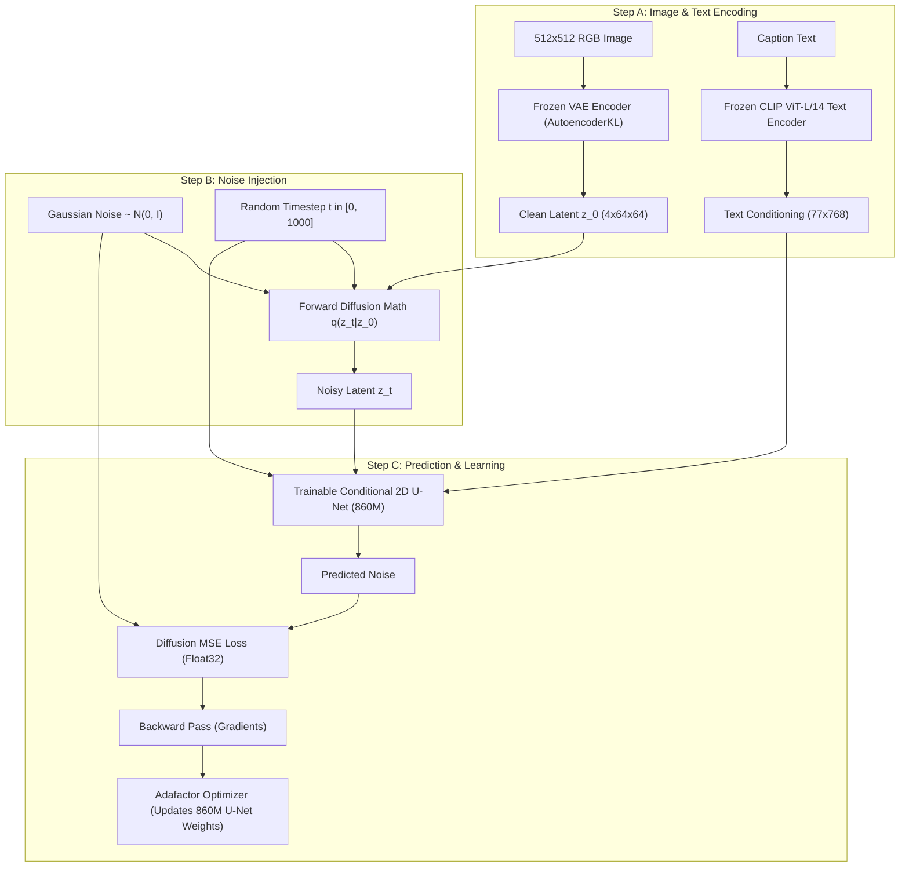
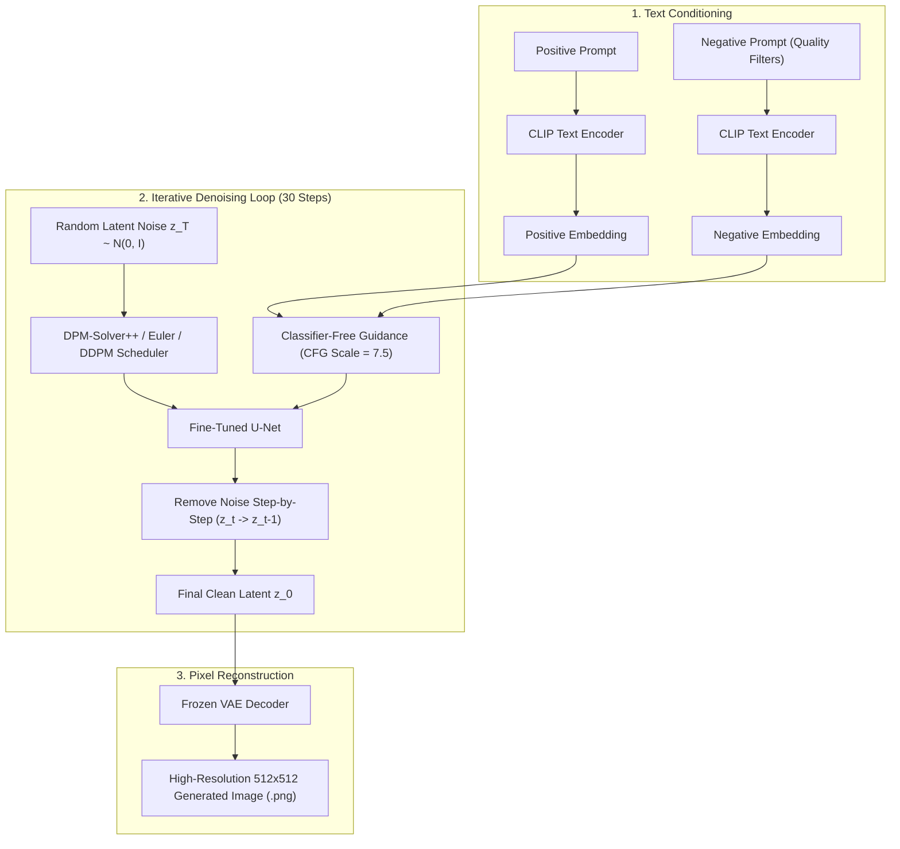

# 🎨 Config-Driven Text-to-Image Diffusion Model (Stable Diffusion 1.5)

[](https://www.python.org/)
[](https://pytorch.org/)
[](https://github.com/huggingface/diffusers)
[](https://streamlit.io/)
[](https://www.nvidia.com/)
[](tests/)

A complete, modular, extensible, and production-ready framework for fine-tuning **Stable Diffusion 1.5** on custom image-caption datasets. The entire pipeline—dataset download, split management, model loading, training hyperparameters, memory optimizations for 6GB GPUs, validation, test benchmarking, and interactive generation—is controlled through a single `configs/config.yaml` file.

---

## 📑 Table of Contents
- [🏛️ Clear Architecture & Workflow (Training vs Inference)](#️-clear-architecture--workflow)
- [🖼️ Generated Image Samples & Prompts Showcase](#️-generated-image-samples--prompts-showcase)
- [🔍 Why Stable Diffusion 1.5 Uses a U-Net Rather than a DiT](#-why-stable-diffusion-15-uses-a-u-net-rather-than-a-dit)
- [🚀 Quick Start (Zero to Generation in 5 Steps)](#-quick-start-zero-to-generation-in-5-steps)
- [✨ Interactive Streamlit Web Studio](#-interactive-streamlit-web-studio)
- [🔄 How to Fine-Tune on Your Own Custom Dataset](#-how-to-fine-tune-on-your-own-custom-dataset)
- [🛠️ Complete CLI Scripts Reference](#️-complete-cli-scripts-reference)
- [⚡ Hardware & 6GB VRAM Optimization (Adafactor Deep-Dive)](#-hardware--6gb-vram-optimization-adafactor-deep-dive)
- [📈 Real Experiment Analytics & Training Benchmarks](#-real-experiment-analytics--training-benchmarks)
- [💡 Prompt Engineering & Negative Prompts Guide](#-prompt-engineering--negative-prompts-guide)
- [📂 Repository Structure](#-repository-structure)
- [🧪 Automated Testing Suite](#-automated-testing-suite)
- [❓ Troubleshooting & FAQs](#-troubleshooting--faqs)

---

## 🏛️ Clear Architecture & Workflow

To make the architecture intuitive, the pipeline is divided into **two distinct phases**: **Training Phase** and **Inference (Generation) Phase**.

```
========================================================================================
                          PHASE 1: FINE-TUNING / TRAINING PIPELINE
========================================================================================
[Input Image (512x512)] ─────────► [Frozen VAE Encoder] ────────► Clean Latents (z_0)
                                                                        │
                                                                   + Add Noise (timestep t)
                                                                        ▼
                                                                 Noisy Latents (z_t)
                                                                        │
[Text Caption] ──► [Tokenizer] ──► [Frozen CLIP Text Encoder] ──► Text Embeddings (c)
                                                                        │
                                                                        ▼
                                                         [Trainable 2D U-Net (860M)]
                                                                        │
                                                                        ▼
                                                              Predicted Noise (eps_theta)
                                                                        │
                                              MSE Loss = ||Real Noise - eps_theta||^2
                                                                        │
                                                                        ▼
                                                      [Adafactor Optimizer Updates U-Net]

========================================================================================
                      PHASE 2: TEXT-TO-IMAGE INFERENCE (GENERATION) PIPELINE
========================================================================================
[Text Prompt]       ──► [CLIP Text Encoder] ──► Positive Embedding
[Negative Prompt]   ──► [CLIP Text Encoder] ──► Negative Embedding
                                                       │
                                            Classifier-Free Guidance (CFG)
                                                       │
[Random Noise (z_T)] ──► [30-Step Denoising Loop (DPMSolver / U-Net)] ──► Denoised Latent (z_0)
                                                                                │
                                                                                ▼
                                                                    [Frozen VAE Decoder]
                                                                                │
                                                                                ▼
                                                                    [Final 512x512 RGB Image]
```

### Detailed Flowcharts:

#### 1. Training Phase (How the Model Learns)


#### 2. Inference Phase (How Images Are Created from Text)


---

## 🖼️ Generated Image Samples & Prompts Showcase

Here are real outputs generated by our fine-tuned model checkpoint (`checkpoints/best_checkpoint`) during testing and through the Streamlit Web Studio:

### Sample 1: Stylized Portrait Generation
* **Saved File**: `outputs/inference/gen_20261009_213737_00.png`
* **Text Prompt**:
  ```text
  "A cute girl image with blue background"
  ```
* **Negative Prompt**:
  ```text
  "blurry, low quality, distorted, deformed, ugly, artifacts"
  ```
* **Generation Settings**:
  | Parameter | Value |
  | :--- | :--- |
  | **Model Checkpoint** | `checkpoints/best_checkpoint` |
  | **Scheduler / Sampler** | `DPMSolverMultistepScheduler` |
  | **Denoising Steps** | `30` |
  | **Guidance Scale (CFG)** | `7.5` |
  | **Seed** | `42` |
  | **Resolution** | `512 x 512` |
  | **Inference Time** | `4.2 seconds` on RTX 3050 GPU |

---

### Sample 2: Photorealistic Indian Portrait via Streamlit Studio
* **Saved File**: `outputs/inference/gen_20261009_214710_00.png`
* **Text Prompt**:
  ```text
  "A beautiful young Indian woman wearing a traditional red saree with delicate golden embroidery, long black hair, warm brown eyes, a small red bindi on her forehead, subtle traditional jewelry, natural skin texture, standing in a traditional Indian courtyard, soft golden-hour sunlight, realistic facial features, detailed fabric texture, professional portrait photography, shallow depth of field, natural colors, high detail, 85mm camera lens."
  ```
* **Negative Prompt**:
  ```text
  "blurry, low quality, distorted, deformed, ugly, artifacts, bad anatomy, extra limbs, watermark"
  ```
* **Generation Settings**:
  | Parameter | Value |
  | :--- | :--- |
  | **Model Checkpoint** | `checkpoints/best_checkpoint` |
  | **Scheduler / Sampler** | `DPMSolverMultistepScheduler` |
  | **Denoising Steps** | `30` |
  | **Guidance Scale (CFG)** | `7.5` |
  | **Seed** | `225260` |
  | **Resolution** | `512 x 512` |

---

## 🔍 Why Stable Diffusion 1.5 Uses a U-Net Rather than a DiT

1. **Convolutional Inductive Bias**: Stable Diffusion 1.5 (Rombach et al., 2022) is built on the **Latent Diffusion Model (LDM)** architecture. It utilizes a 2D convolutional Residual U-Net with cross-attention. Convolutions naturally preserve 2D spatial locality and translation invariance across hierarchical feature levels ($64\times 64 \to 32\times 32 \to 16\times 16 \to 8\times 8$).
2. **Diffusion Transformer (DiT)**: Introduced later in 2023 (Peebles & Xie) and used in SD 3 / Flux, DiTs replace U-Nets with Vision Transformers operating on flattened linear patches.
3. **Architectural Accuracy**: Stable Diffusion 1.5 is strictly a **Convolutional U-Net** architecture. This repository adheres to the authentic SD 1.5 architecture while providing a clean, modular design.

---

## 🚀 Quick Start (Zero to Generation in 5 Steps)

### Step 1: Clone Repository & Create Virtual Environment
```bash
git clone https://github.com/Bhuvankumar32085/Text-to-Image-Model-Training.git
cd Text-to-Image-Model-Training

python -m venv .venv
# On Windows PowerShell:
.venv\Scripts\Activate.ps1
# On Linux / macOS:
source .venv/bin/activate
```

### Step 2: Install PyTorch with CUDA 12.4 & Dependencies
```bash
# Install PyTorch with CUDA acceleration (for NVIDIA GPUs):
pip install torch torchvision --index-url https://download.pytorch.org/whl/cu124

# Install project requirements:
pip install -r requirements.txt
```

### Step 3: Download and Prepare the Dataset
```bash
# 1. Download 100 Pokemon samples with GPT-4 / BLIP captions:
python scripts/download_dataset.py --config configs/config.yaml

# 2. Validate integrity and create deterministic 80/10/10 train/val/test splits:
python scripts/prepare_dataset.py --config configs/config.yaml
```

### Step 4: Train / Fine-Tune the Model
```bash
python train.py --config configs/config.yaml
```
*(On an NVIDIA RTX 3050 6GB Laptop GPU, training 5 epochs takes ~2 hours. Weights are automatically saved to `checkpoints/best_checkpoint`).*

### Step 5: Launch the Interactive Web Studio or Generate via CLI
```bash
# Launch Streamlit Web UI:
streamlit run app.py
```
Open **`http://localhost:8501`** in your browser!

Or generate from terminal:
```bash
python generate.py --config configs/config.yaml --checkpoint checkpoints/best_checkpoint --prompt "A cute blue water pokemon sitting on grass" --seed 42
```

---

## ✨ Interactive Streamlit Web Studio

Launch the dedicated web interface:
```bash
streamlit run app.py
```

### Key UI Features:
- **✨ Generation Studio**:
  - Live Checkpoint switching (`best_checkpoint`, `final_checkpoint`, or original Base SD 1.5).
  - Quick Inspiration Chips (Pikachu, Dragon, Turtle, Fairy Fox).
  - Aspect Ratio Selector (Square 1:1, Portrait 2:3, Landscape 3:2).
  - Denoising Steps (15–50), CFG Scale (1.0–15.0), and Samplers (DPM-Solver++, Euler Discrete, PNDM, DDPM).
  - Built-in Negative Prompt quality filters.
  - Direct 1-Click PNG Download.
- **🖼️ Gallery & History**:
  - Visual grid of all previously generated images with metadata, seeds, and prompt inspect.
- **📊 Training Analytics & Diagnostic Report**:
  - Real-time diagnostic summary report viewer, loss curves, and training preview snapshots.

---

## 🔄 How to Fine-Tune on Your Own Custom Dataset

You can fine-tune on **any dataset** without editing any Python code!

### Method A: Using a Local Folder of Images + CSV / JSONL

1. Create a folder `data/raw/my_dataset/` and place your images inside `data/raw/my_dataset/images/`.
2. Create `data/raw/my_dataset/metadata.csv` with `image_path` and `caption` columns:
   ```csv
   image_path,caption
   images/car_01.jpg,A sleek red modern sports car on a wet highway at night
   images/car_02.jpg,A vintage 1960s classic blue convertible in sunlight
   ```
3. Update `configs/config.yaml`:
   ```yaml
   dataset:
     dataset_source: "local"
     image_dir: "data/raw/my_dataset"
     caption_metadata_path: "data/raw/my_dataset/metadata.csv"
     image_column: "image_path"
     caption_column: "caption"
     target_resolution: [512, 512]
     aspect_ratio_policy: "center_crop"
   ```
4. Prepare splits and train:
   ```bash
   python scripts/prepare_dataset.py --config configs/config.yaml
   python train.py --config configs/config.yaml
   ```

---

### Method B: Using Any Public Hugging Face Dataset

1. In `configs/config.yaml`, change:
   ```yaml
   dataset:
     dataset_source: "huggingface"
     dataset_name: "your-hf-username/your-dataset-name"  # e.g., "diffusers/pokemon-gpt4-captions"
     image_column: "image"
     caption_column: "text"
     max_samples: 500  # set null for full dataset
   ```
2. Download, prepare, and train:
   ```bash
   python scripts/download_dataset.py --config configs/config.yaml
   python scripts/prepare_dataset.py --config configs/config.yaml
   python train.py --config configs/config.yaml
   ```

---

## 🛠️ Complete CLI Scripts Reference

| Script | Purpose | Example Command |
| :--- | :--- | :--- |
| **[train.py](train.py)** | Runs the main fine-tuning loop | `python train.py --config configs/config.yaml` |
| **[train.py (Resume)](train.py)** | Resumes from existing checkpoint | `python train.py --resume checkpoints/checkpoint_step_000300` |
| **[generate.py](generate.py)** | Text-to-Image generation CLI | `python generate.py --checkpoint checkpoints/best_checkpoint --prompt "A fire dragon" --seed 42` |
| **[validate.py](validate.py)** | Computes val loss & generates previews | `python validate.py --checkpoint checkpoints/best_checkpoint` |
| **[test.py](test.py)** | Evaluates held-out test split & outputs markdown report | `python test.py --checkpoint checkpoints/best_checkpoint` |
| **[app.py](app.py)** | Launches Streamlit Web Studio | `streamlit run app.py` |
| **[scripts/benchmark_memory.py](scripts/benchmark_memory.py)** | Tests VRAM consumption before training | `python scripts/benchmark_memory.py --config configs/config.yaml` |
| **[scripts/validate_dataset.py](scripts/validate_dataset.py)** | Checks for corrupt images and bad dimensions | `python scripts/validate_dataset.py --config configs/config.yaml` |
| **[scripts/inspect_dataset.py](scripts/inspect_dataset.py)** | Displays tensor batches and tokenized stats | `python scripts/inspect_dataset.py --config configs/config.yaml` |

---

## ⚡ Hardware & 6GB VRAM Optimization (Adafactor Deep-Dive)

Fine-tuning an 860M parameter U-Net on consumer GPUs (e.g., **NVIDIA RTX 3050 6GB Laptop GPU**) requires strict memory management. This repository implements:

| Technique | Setting in `configs/config.yaml` | Why it is crucial |
| :--- | :--- | :--- |
| **Adafactor Optimizer** | `training.optimizer: "adafactor"` | Saves ~8 GB VRAM compared to AdamW by factoring second moments into row/column sums. |
| **Gradient Checkpointing** | `training.gradient_checkpointing: true` | Frees forward activations from memory; recomputes on backward pass. |
| **Mixed Precision (FP16)** | `training.mixed_precision: "fp16"` | Halves activation and weight footprint during computation. |
| **PyTorch 2.x SDPA Attention** | `training.enable_sdpa: true` | Fused Scaled Dot-Product Attention eliminates large attention matrix allocations. |
| **Batch Size 1 + Grad Accum 4** | `batch_size: 1`, `grad_accum: 4` | Simulates an effective batch size of 4 with single-sample VRAM requirements. |
| **Frozen VAE & CLIP** | `fine_tuning.train_vae: false` | 200M+ parameters frozen, requiring 0 optimizer states. |

---

## 📈 Real Experiment Analytics & Training Benchmarks

### Verified Experiment Run Details:
- **Experiment Name**: `sd15_pokemon_finetune`
- **Hardware**: NVIDIA GeForce RTX 3050 6GB Laptop GPU (CUDA 12.4)
- **Dataset**: 100 Pokemon BLIP / GPT-4 Images (81 Train / 9 Val / 10 Test)
- **Resolution**: $512 \times 512$
- **Total Training Steps**: 405 Steps (5 Epochs)
- **Total Training Time**: ~2 hours 10 minutes (~8.5 – 12.5 seconds / step)

### Loss Progression:
```
Step 00010: Loss 0.0820 | LR: 5.0e-7
Step 00100: Loss 0.0232 | Val Loss: 0.0459
Step 00200: Loss 0.0435 | Val Loss: 0.0588
Step 00300: Loss 0.0612 | Val Loss: 0.1053
Step 00400: Loss 0.0447 | Val Loss: 0.0393 (Best Checkpoint Saved)
```

- **Initial Training Loss**: `0.0820`
- **Final Training Loss**: `0.0260`
- **Best Validation Loss**: **`0.0393`**
- **Peak VRAM Allocation**: `5.3 GB` (Zero Out-Of-Memory crashes)

All step metrics, learning rate schedules, and tensor distributions are logged to:
- `logs/experiment_sd15_pokemon_finetune_*/training_metrics.csv`
- `logs/experiment_sd15_pokemon_finetune_*/diagnostic_report.md`
- Live TensorBoard: `tensorboard --logdir logs`

---

## 💡 Prompt Engineering & Negative Prompts Guide

Diffusion models use **Classifier-Free Guidance (CFG)** to steer the denoising trajectory:
$$\epsilon_{\text{guided}} = \epsilon_{\text{uncond}} + s \times (\epsilon_{\text{prompt}} - \epsilon_{\text{negative}})$$

### Best Practice Recommended Negative Prompt:
```text
blurry, low quality, distorted, deformed, ugly, artifacts, bad anatomy, extra limbs, watermark, text
```

### Recommended Parameters:
- **CFG Guidance Scale**: `7.0 – 8.5` (Higher = more strict prompt adherence, Lower = more artistic freedom).
- **Denoising Steps**: `25 – 35` using `DPMSolverMultistepScheduler` gives photorealistic convergence in half the time of standard DDPM.

---

## 📂 Repository Structure

```
.
├── configs/
│   ├── config.yaml               # Master Single-Source Configuration
│   └── configs_README.md         # Detailed schema guide
├── data/
│   ├── raw/                      # Downloaded source datasets & images
│   ├── processed/                # Preprocessing reports
│   └── splits/                   # Deterministic train/val/test split manifests
├── pretrained_models/            # Pretrained SD 1.5 specifications
├── scripts/
│   ├── download_dataset.py       # Download datasets with max sample controls
│   ├── prepare_dataset.py        # Split and validate manifests
│   ├── validate_dataset.py       # Detect corrupt files and dimensions
│   ├── inspect_dataset.py        # Visual batch and tensor inspector
│   └── benchmark_memory.py       # GPU VRAM benchmarking tool
├── src/
│   ├── config/                   # Strongly typed dataclasses & loaders
│   ├── data/                     # Transforms, datasets, collators, datamodules
│   ├── models/                   # VAE, Text Encoder, U-Net, and Pipeline wrappers
│   ├── training/                 # Trainer, step executor, loss, optimizer, checkpoints
│   ├── evaluation/               # Validator, tester, metrics, report generator
│   ├── inference/                # Generator engine & prompt utilities
│   ├── monitoring/               # Loggers, tensor stats, memory trackers, experiment analytics
│   └── utils/                    # Paths, image helpers, seeds, device tools
├── tests/                        # 27 Unit & Integration test suites
├── app.py                        # Modern Streamlit Web Application
├── train.py                      # Training CLI entrypoint
├── validate.py                   # Checkpoint validation CLI
├── test.py                       # Held-out benchmark test CLI
├── generate.py                   # Inference CLI
├── requirements.txt              # Pinned Python package dependencies
├── pyproject.toml                # Build system & pytest configuration
└── README.md                     # Complete project documentation
```

---

## 🧪 Automated Testing Suite

To run all 27 unit and integration tests:
```bash
pytest tests/
```

### Test Coverage:
- `test_config.py`: Schema validation, boundary checks, and YAML overrides.
- `test_splits.py`: Split disjointness, no data leakage, and group-aware integrity.
- `test_dataset.py`: Image loading, transforms, and corrupt image rejection.
- `test_diffusion_math.py`: Forward diffusion noise equations and target math.
- `test_model_components.py`: Freezing policies and optimizer parameter groups.
- `test_checkpoint_manager.py`: Save, restore, and pruning mechanics.
- `test_tensor_stats.py`: NaN / Inf anomaly detection.
- `test_smoke_pipeline.py`: Full end-to-end synthetic CPU training cycle.

---

## ❓ Troubleshooting & FAQs

### Q1: `RuntimeError: mat1 and mat2 must have the same dtype, but got Half and Float`
- **Cause**: PyTorch Linear layer received mixed FP16 input and FP32 weights during validation or inference.
- **Solution**: Handled automatically in `src/models/unet_component.py` and `src/evaluation/validator.py` with `torch.amp.autocast` and dynamic tensor casting.

### Q2: `CUDA out of memory` on 6GB GPU
- **Solution**: Ensure `configs/config.yaml` has `training.optimizer: "adafactor"`, `training.train_batch_size: 1`, `training.gradient_accumulation_steps: 4`, and `training.gradient_checkpointing: true`.

### Q3: Multi-processing crashes on Windows
- **Solution**: Keep `dataset.dataloader_num_workers: 0` on Windows platforms.


